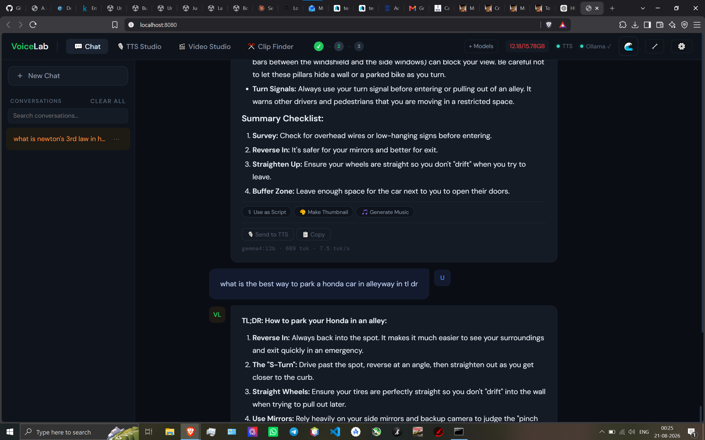
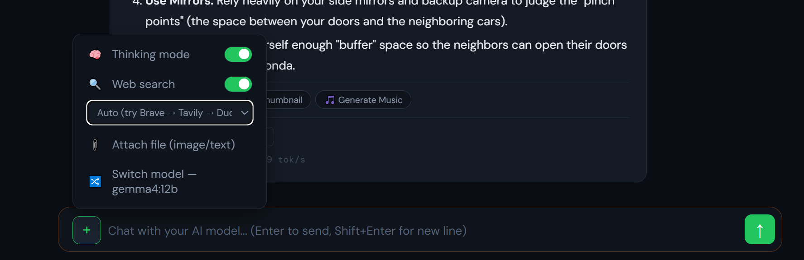
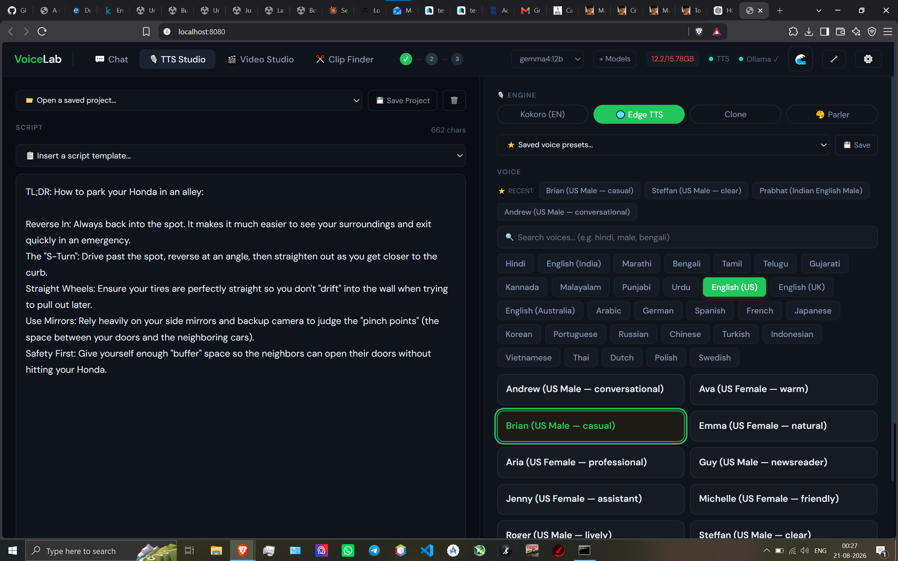
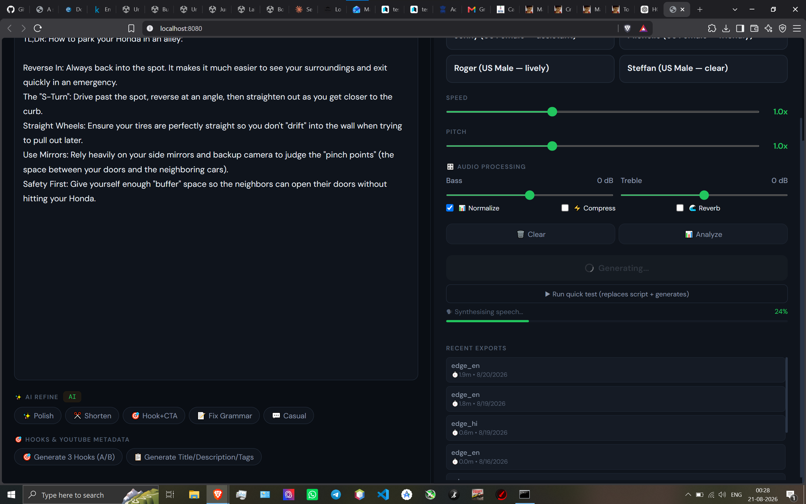
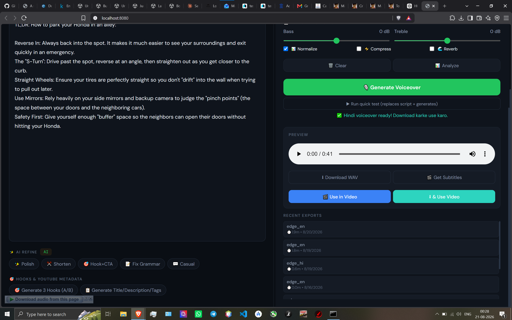
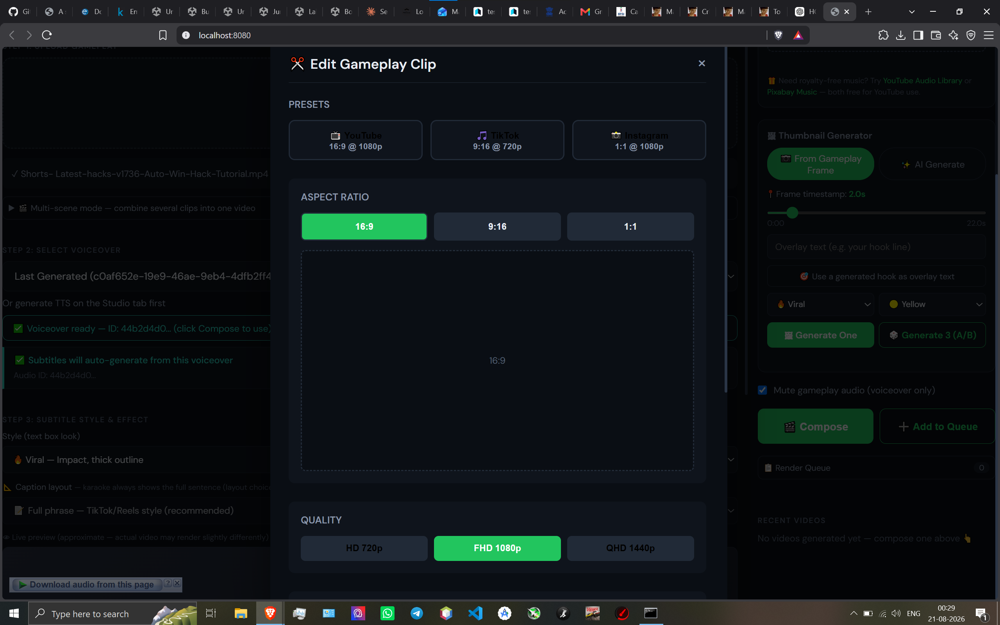
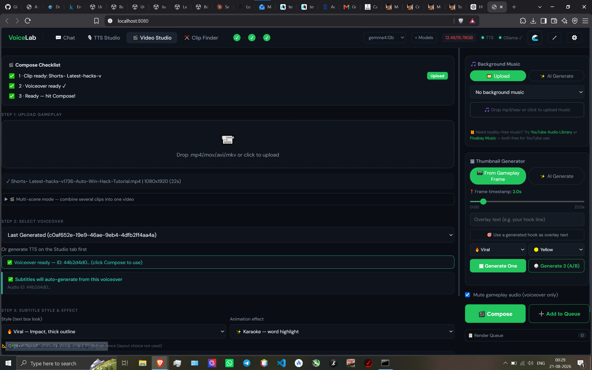
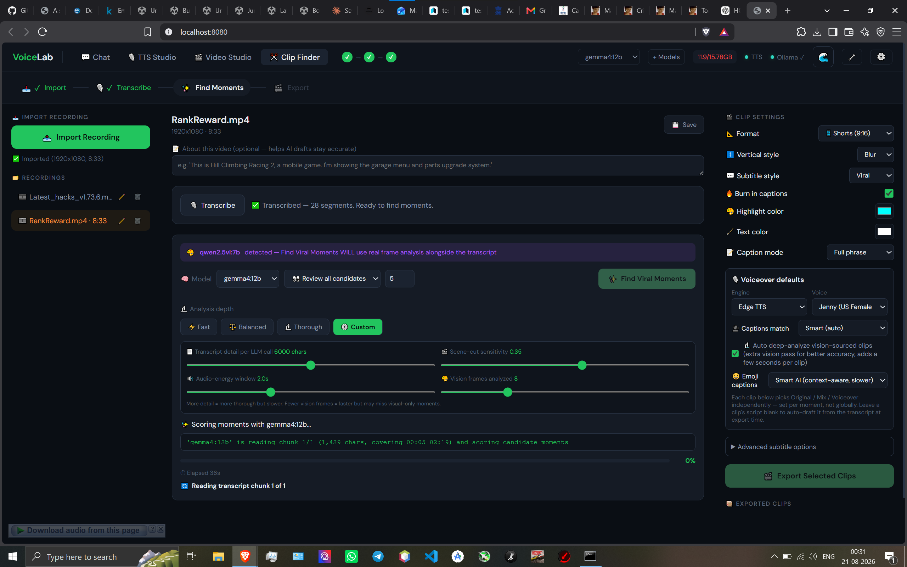

# VoiceLab

**An all-in-one, 100% local AI video/voiceover studio.**
No cloud, no subscriptions, no API keys required. Everything runs on your own PC.

VoiceLab is four tools in one — a local AI chat assistant, a full TTS
voiceover studio, a video composer with auto-captions, and a viral-clip
finder that watches your footage and tells you what to cut — all talking
to each other, all running entirely on your own machine.

> Built by **Ashmit**. Code implementation with Claude (Anthropic).
> If you build on this, a credit/link back is appreciated but not required —
> see [LICENSE](./LICENSE).

---

## Screenshots

### 💬 Chat
Not just a chatbox — this is a full local ChatGPT-style assistant wired
into an Ollama model of your choice.

- **Thinking mode**: watch the model's actual reasoning stream in live,
  before it commits to a final answer — toggle it per-conversation from
  the `+` menu.
- **Web search, 3 providers**: Brave, Tavily, or DuckDuckGo — pick one
  manually or let "Auto" try them in priority order. Answers come back
  with cited sources.
- **File attach**: drop in an image (works with vision-capable models)
  or a text file for the model to read.
- Every response can be sent straight into TTS Studio, turned into a
  thumbnail prompt, or used to generate background music — the chat
  output feeds the rest of the app directly.
- Full conversation history: rename, pin, search, export as text, or
  delete any past chat.

### 🎙️ TTS Studio
A real voiceover studio, not a single "generate" button.

- **4 engines**: Edge TTS (free, cloud-quality, dozens of languages),
  Kokoro (fully offline), Clone (your own voice), and Parler
  (style-conditioned generation).
- **Full voice library** searchable by language or accent — Hindi,
  Bengali, Tamil, Telugu, Marathi, Punjabi, Urdu, Arabic, Japanese,
  Korean, and more, each with named character voices (not just "Voice 1,
  Voice 2").
- **Speed/pitch/EQ** (bass, treble, normalize, compress, reverb) tuned
  per generation, with an audio Analyze tool.
- **AI Refine** on the script itself — Polish, Shorten, Hook+CTA, Fix
  Grammar, Casual tone — plus one-click **Hook (A/B) and
  Title/Description/Tags generation** for YouTube, all from the same
  local model powering Chat.
- Generates real playable output with a scrubbable preview, WAV
  download, subtitle extraction, and a direct "Use in Video" handoff
  into Video Studio — no manual file juggling between tools.

### 🎬 Video Studio
Takes raw gameplay/footage straight to a finished, captioned, exportable
short.

- Presets for **YouTube (16:9), TikTok (9:16), Instagram (1:1)** at up
  to QHD 1440p, with a live style preview before you commit.
- **Karaoke-style word-highlight captions**, burned in with configurable
  style, layout, and color — auto-generated from whichever voiceover you
  picked, no manual subtitle timing.
- **AI thumbnail generator** — pull a frame straight from the gameplay
  or generate one entirely with AI, then overlay a hook line pulled
  directly from a Chat-generated hook.
- **Background music** — upload your own or generate one with AI,
  mixed automatically under the voiceover.
- **Render queue** — queue multiple compositions and let them process
  back to back instead of babysitting one export at a time.

### ✂️ Clip Finder
This is the deepest tab in the app — it doesn't just cut clips, it
**watches and understands the footage** to find the moments worth
posting.

- Import any long-form recording, and it **transcribes the whole thing
  automatically** (28 segments in the example above) — fully local,
  no cloud transcription service.
- **Find Viral Moments** doesn't just read the transcript — when a
  vision-capable model is selected (like `qwen2.5vl`), it does **real
  frame-by-frame visual analysis alongside the transcript**, so it can
  catch visually interesting moments that never got said out loud.
- Tunable analysis depth (Fast / Balanced / Thorough / Custom, with
  direct control over transcript chunk size, scene-cut sensitivity,
  audio-energy window, and how many vision frames get sampled per clip)
  — trade speed for thoroughness depending on your hardware and how
  long the source footage is.
- Each candidate moment gets its own independent voiceover script,
  engine, and voice — nothing is forced to match globally.
- Exports straight to Shorts/Reels format with burned-in captions,
  smart or manual caption-to-audio matching, and AI-context-aware emoji
  captions, ready to post.

---

## Is this for me?

- ✅ You're on **Windows 10 or 11**
- ✅ You want everything to run **locally and privately** — nothing leaves your PC
- ✅ You don't need a powerful GPU — it works on CPU too (just slower for
  some AI features)

## What you get, and what it needs

| Feature | Needs | Works without it? |
|---|---|---|
| Chat with a local model | [Ollama](https://ollama.com) + a local model | App still runs, chat just won't work until you install Ollama |
| Thinking mode (see model reasoning) | A reasoning-capable model (Qwen3, DeepSeek-R1, etc.) | Off by default — regular models just answer directly |
| Web search in chat | A free API key (Brave or Tavily) *or* nothing at all (DuckDuckGo works with zero setup) | Chat still works without any search |
| Voiceover (Edge TTS / Kokoro) | Nothing extra | Always works |
| Captions + emoji, video export | Nothing extra (ffmpeg is auto-installed) | Always works |
| Clip Finder's vision-based moment finding | A vision-capable Ollama model (e.g. `qwen2.5vl`) | Falls back to transcript-only analysis with a text model |
| AI thumbnail / AI music / voice clone | A one-click install from inside the app | App still runs, just skips those tabs |

The app **scans your PC's RAM/GPU automatically** and recommends AI models
that will actually run well on your hardware — you're never forced into one
specific model.

### Chat highlights

- **Thinking mode** — toggle from the chat's `+` menu. Shows the model's
  full reasoning live as it generates, then collapses into a clickable
  "Reasoning" summary. Uses more context/RAM — tune the size in Settings
  if a model reasons but never reaches a final answer (and check Ollama's
  own app Settings → Context length too, it can be a second ceiling).
- **Web search** — also in the `+` menu. "Auto" tries Brave → Tavily →
  DuckDuckGo in order, or pick one manually. Brave (2,000 free
  queries/month) and Tavily (1,000 free/month) need a free API key from
  their sites, pasted into Settings. DuckDuckGo needs no key at all but
  gives more limited results.
- **Stop button** — the send button becomes a stop button while
  generating, so a long or stuck response can be cancelled anytime.
- **Chat history** — rename, pin, search, export as text, or delete any
  conversation from the hover menu in the sidebar.
- **Export paths** — set a default save folder per export type (video/
  audio/thumbnail/music) in Settings, or choose a one-off custom folder
  each time.

---

## Install (one time only)

1. **Download this repository.**
   Click the green **Code** button on GitHub → **Download ZIP** → extract it
   anywhere (e.g. your Desktop).

2. **Double-click `setup.bat`.**
   This is the only step that installs anything. It will:
   - Check you have a compatible Python version (and tell you exactly what
     to do if you don't)
   - Check free disk space and internet connection
   - Set up a private Python environment *inside this folder only* — it
     never touches anything else on your PC
   - Scan for an NVIDIA GPU and install the right version of the AI engine
     for your hardware automatically
   - Check for Ollama (used for AI script writing) and guide you if it's
     missing
   - Offer to add a Desktop / Start Menu shortcut, or auto-start on login

   This step needs internet access and can take 5–15 minutes depending on
   your connection. You'll see clear progress messages the whole way.

3. **When it says "Setup complete!", you're done.**

## Run VoiceLab (every time after)

Double-click **`start.bat`** (or the shortcut you created). It automatically
checks for any missing packages before launching (so an update never
leaves you needing to manually run `pip install`), then opens a browser
window at `http://localhost:8080`. Close the black window to stop the app.

## Uninstall

Double-click **`uninstall.bat`**. It removes the Python environment and any
shortcuts. It will ask separately before deleting your exported videos or
downloaded AI models — your work is never deleted silently.

---

## Something not working?

Check **[TROUBLESHOOTING.md](./TROUBLESHOOTING.md)** first — it covers the
most common setup and usage issues in plain English with exact fixes.

---

## For developers

- Backend: `server.py` (FastAPI, single file)
- Frontend: `index.html` (single page, no build step)
- The app's own Settings tab has a live dependency checker + one-click
  installer for the heavier optional AI stack (`/dependency-status` and
  `/install-dependency/{key}` endpoints in `server.py`)
- `requirements.txt` is intentionally pinned to match the versions the
  in-app installer uses, so nothing conflicts later
- Chat streams via Server-Sent Events (`/chat`) with separate `thinking`
  and `content` token channels, plus a final `stats` event (tokens,
  speed, model, search/thinking used, stop reason)
- Web search is provider-agnostic (`web_search_dispatch()` in
  `server.py`) — auto-fallback across Brave/Tavily/DuckDuckGo or a
  forced single provider, same interface either way
- Clip Finder's vision analysis path is separate from its transcript-only
  path — it detects whether the selected model supports vision and
  changes its own analysis strategy accordingly, rather than always
  running the heavier pass

Contributions/forks welcome under the MIT license. A mention of the
original author is appreciated if you build something on top of this.
